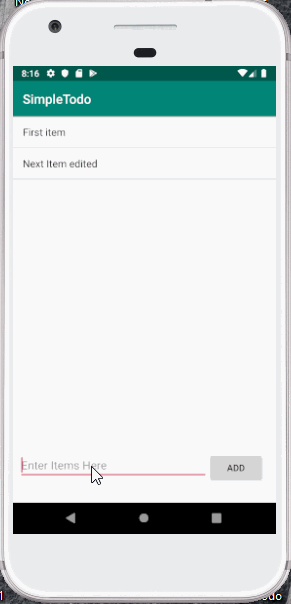

# Pre-work - *Simple Todo*

Simple Todo is an android app that allows building a todo list and basic todo items management functionality including

Submitted by **Vastie Paulo**

Time spent: **6** hours spent in total

## User Story

The following  **required** functionality is completed:

* [x] User can **successfully add and remove items** from todo list
* [ ] User can **Tap a todo item in the list and bring up an edit screen for the todo item** and them have any changes to the text reflected in the todo list.
* [x] User can **persist todo item**  and retrieve them properly on app restart

The following **optional** features are implemented:

* [ ] Persist the todo item [into SQLite](http://guides.codepath.com/android/Persisting-Data-to-the-Device#sqlite) instead of a test file
* [ ] Improve style of the todo items in the list [using a custom adapter](http://guides.codepath.com/android/Using-an-ArrayAdapter-with-ListView)
* [ ] Add support for completion due dates for todo items (ans display list view item)
* [ ] Use a [DialogFragment](http://guides.codepath.com/android/Using-DialogFragment) instead of new activity for editing items
* [ ] Add support for selecting  the priority of each todo item (and displayin listview item)
* [ ] Tweak the style improving the UI / UX, play wwith colors, images and backgrounds

The following **additional** features are implmented:

* [ ] List anything else that you can  get done to improve the app functionality!

## Video Walkthrough

Here's a walkthrough of implementation stories:

GIF created with [LiceCap](http://www.cockos.com/licecap/).

## Notes

Describe by challenges encountered while building the app.

## License

Copyright [yyyy] [nama of copyright owner]

Licensed under the Apache License, Version 2.0 (The "License");
You may not use this file except in compliance with the License.
You may obtain a copy of the License at:

    http://www.apache.org/Licenses/LICENSE-2.0
    
Unless required by applicable law or agreed to in writing, software
distributed under the license is distributed on an "AS IS" BASIS,
WITHOUT WARRANTIES OR CONDITIONS OF ANY KIND, either express or implied.
See the license for specific language governing permissions and 
limitataions under the License.
